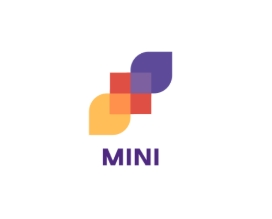

<!-- Improved compatibility of back to top link: See: https://github.com/othneildrew/Best-README-Template/pull/73 -->
<a id="readme-top"></a>
<!--
*** Thanks for checking out the Best-README-Template. If you have a suggestion
*** that would make this better, please fork the repo and create a pull request
*** or simply open an issue with the tag "enhancement".
*** Don't forget to give the project a star!
*** Thanks again! Now go create something AMAZING! :D
-->


<!-- PROJECT SHIELDS -->
<!--
*** I'm using markdown "reference style" links for readability.
*** Reference links are enclosed in brackets [ ] instead of parentheses ( ).
*** See the bottom of this document for the declaration of the reference variables
*** for contributors-url, forks-url, etc. This is an optional, concise syntax you may use.
*** https://www.markdownguide.org/basic-syntax/#reference-style-links
-->
[![Contributors][contributors-shield]][contributors-url]
[![Forks][forks-shield]][forks-url]
[![Stargazers][stars-shield]][stars-url]
[![Issues][issues-shield]][issues-url]
[![project_license][license-shield]][license-url]


<!-- PROJECT LOGO -->
<br />
<div align="center">
  <a href="https://github.com/Max-labs/Tableau Mini">
    
  </a>

<h3 align="center">Tableau Mini</h3>

  <p align="center">
    A Semantic Data ingestion extension for Tableau 
    <br />
    <a href="https://github.com/Max-labs/Tableau Mini"><strong>Explore the docs »</strong></a>
    <br />
    <br />
    <a href="https://github.com/Max-labs/Tableau Mini">View Demo</a>
    &middot;
    <a href="https://github.com/Max-labs/Tableau Mini/issues/new?labels=bug&template=bug-report---.md">Report Bug</a>
  </p>
</div>


<!-- TABLE OF CONTENTS -->
<details>
  <summary>Table of Contents</summary>
  <ol>
    <li>
      <a href="#about-the-project">About The Project</a>
      <ul>
        <li><a href="#built-with">Built With</a></li>
      </ul>
    </li>
    <li>
      <a href="#getting-started">Getting Started</a>
      <ul>
        <li><a href="#prerequisites">Prerequisites</a></li>
        <li><a href="#installation">Installation</a></li>
      </ul>
    </li>
    <li><a href="#usage">Usage</a></li>
    <li><a href="#roadmap">Roadmap</a></li>
    <li><a href="#contributing">Contributing</a></li>
    <li><a href="#license">License</a></li>
    <li><a href="#contact">Contact</a></li>
    <li><a href="#acknowledgments">Acknowledgments</a></li>
  </ol>
</details>


<!-- ABOUT THE PROJECT -->
## About The Project

[![Tableau Mini dashboard][product-screenshot]](https://example.com)

This is a project acting as the client side component for the Tableau Mini extension. 

<p align="right">(<a href="#readme-top">back to top</a>)</p>


### Built With

* <a href="https://github.com/Olutoye-lab/Tableau-Mini">
    
  </a>
* <a href="https://github.com/Olutoye-lab/Tableau-Mini">
    
  </a>
* <a href="https://github.com/Olutoye-lab/Tableau-Mini">
    
  </a>
* <a href="https://github.com/Olutoye-lab/Tableau-Mini">
    
    <p>Shadcn</p>
  </a>


<p align="right">(<a href="#readme-top">back to top</a>)</p>


<!-- GETTING STARTED -->
## Getting Started

To Run this project locally:

### Prerequisites

**Sales Force Set Up**
1. Create a Sales Force Account
2. Add a connected app by following the Agent Force Developer Guide. [Sales Force Developer Guide][SF-dev-guide]
3. Add ENV variables:
* SALESFORCE_CLIENT_ID
* SALESFORCE_CLIENT_SECRET
* SALESFORCE_REDIRECT_URI
* SALESFORCE_DOMAIN # ='test' for test sandbox

**If setting up with server**

4. # Tokens (add these after running the script)
Test the full server pipeline once to get these env variables in sf_tokens.json (from server)

* SALESFORCE_ACCESS_TOKEN
* SALESFORCE_INSTANCE_URL
* SALESFORCE_REFRESH_TOKEN

5. Paste the local or remote server URL: 
* Only if server is http://localhost:8000 (default for uvicorn)

POST_URL=http://localhost:8000/save
SSE_URL=http://localhost:8000/events

**.env File**
| ENV variables| 
|--------------|
POST_URL
SSE_URL
SALESFORCE_CLIENT_ID
SALESFORCE_CLIENT_SECRET
SALESFORCE_REDIRECT_URI
SALESFORCE_DOMAIN
SALESFORCE_ACCESS_TOKEN
SALESFORCE_INSTANCE_URL 
SALESFORCE_REFRESH_TOKEN


### Installation

1. Clone the repo
   ```sh
   git clone https://github.com/Olutoye-lab/Tableau-Mini.git
   ```
**Run Locally**

2. Add .env 

3. Start development server
    ```sh
    npm run dev
    ```


<p align="right">(<a href="#readme-top">back to top</a>)</p>


<!-- USAGE EXAMPLES -->
## Usage

This project can be demoed on Tableau through the Tableau through the extension Market Place. [Extensions Market Place][tableau-extensions-api]
- Install the Extension
- Open the Dashboad
- Move to the pannel
- Select a sample dataset
- Enter tableau Credentials and Start!!

This project can also be run locally for both server and client components. __Steps provided above.__


<p align="right">(<a href="#readme-top">back to top</a>)</p>


<!-- ROADMAP -->
## Roadmap

- [x] Intergrate headless client panel into Main dashboard.
- [ ] Working with the Tableau R&D team, to utilise tableau connections architecture into Mini, for seamless and robust data ingestion.
- [ ] Implement a feature to automatically validate and score datasets based on specified business logic.
    - e.g.  sales pipeline must be Lead → Qualified → Demo → Proposal → Closed (Won). 
    - If a dataset violates this it is negatively scored (-2)
- [ ] Implementing caching to remove re-entering credentials per ingestion.

See the [open issues](https://github.com/Max-labs/Tableau-Mini/issues) for a full list of proposed features (and known issues).

<p align="right">(<a href="#readme-top">back to top</a>)</p>


<!-- CONTRIBUTING -->
## Contributing

Contributions are what make the open source community such an amazing place to learn, inspire, and create. Any contributions you make are **greatly appreciated**.

If you have a suggestion that would make this better, please fork the repo and create a pull request. You can also simply open an issue with the tag "enhancement".
Don't forget to give the project a star! Thanks again!

1. Fork the Project
2. Create your Feature Branch (`git checkout -b feature/AmazingFeature`)
3. Commit your Changes (`git commit -m 'Add some AmazingFeature'`)
4. Push to the Branch (`git push origin feature/AmazingFeature`)
5. Open a Pull Request

<p align="right">(<a href="#readme-top">back to top</a>)</p>

### Top contributors:

<a href="https://github.com/Max-labs/Tableau-Mini/graphs/contributors">
  
</a>


<!-- LICENSE -->
## License

Distributed under the project_license. See `LICENSE.txt` for more information.

<p align="right">(<a href="#readme-top">back to top</a>)</p>


<!-- ACKNOWLEDGMENTS -->
## Acknowledgments

Thank you to the Tableau Hackathon team for providing a platform to build skill driven projects. 

<p align="right">(<a href="#readme-top">back to top</a>)</p>


<!-- MARKDOWN LINKS & IMAGES -->
<!-- https://www.markdownguide.org/basic-syntax/#reference-style-links -->
[contributors-shield]: https://img.shields.io/github/contributors/Max-labs/Tableau Mini.svg?style=for-the-badge
[contributors-url]: https://github.com/Max-labs/Tableau Mini/graphs/contributors
[forks-shield]: https://img.shields.io/github/forks/Max-labs/Tableau Mini.svg?style=for-the-badge
[forks-url]: https://github.com/Max-labs/Tableau Mini/network/members
[stars-shield]: https://img.shields.io/github/stars/Max-labs/Tableau Mini.svg?style=for-the-badge
[stars-url]: https://github.com/Max-labs/Tableau Mini/stargazers
[issues-shield]: https://img.shields.io/github/issues/Max-labs/Tableau Mini.svg?style=for-the-badge
[issues-url]: https://github.com/Max-labs/Tableau Mini/issues
[license-shield]: https://img.shields.io/github/license/Max-labs/Tableau Mini.svg?style=for-the-badge
[license-url]: https://github.com/Max-labs/Tableau Mini/blob/master/LICENSE.txt
[-shield]: https://img.shields.io/badge/--black.svg?style=for-the-badge&logo=&colorB=555
[-url]: https://.com/in/_username
[product-screenshot]: images/screenshot.png
<!-- Shields.io badges. You can a comprehensive list with many more badges at: https://github.com/inttter/md-badges -->
[Next.js]: https://img.shields.io/badge/next.js-000000?style=for-the-badge&logo=nextdotjs&logoColor=white
[Next-url]: https://nextjs.org/
[python]: https://logos-world.net/wp-content/uploads/2021/10/Python-Emblem.png
[python-url]: https://www.python.org/
[React.js]: https://img.shields.io/badge/React-20232A?style=for-the-badge&logo=react&logoColor=61DAFB
[React-url]: https://reactjs.org/
[tableau-extensions-api]: https://www.tableau.com/sites/default/files/styles/scale_175_wide/public/2021-08/ExtensionsAPI.png?itok=Nt7mjuYq
[tableau-url]: https://www.tableau.com/developer/tools/extensions-api
[salesforce]: https://login.salesforce.com/img/logo214.svg 
[salesforce-url]: https://developer.salesforce.com/docs/einstein/genai/guide/agent-api-get-started.html
[typescript]: 
[typescript-url]
[tailwind]
[tailwind-url]
[shadcn]
[shadcn-url]

<!-- Custom -->
[SF-dev-guide]: https://developer.salesforce.com/docs/ai/agentforce/guide/agent-api-get-started.html#add-connected-app-to-agent
